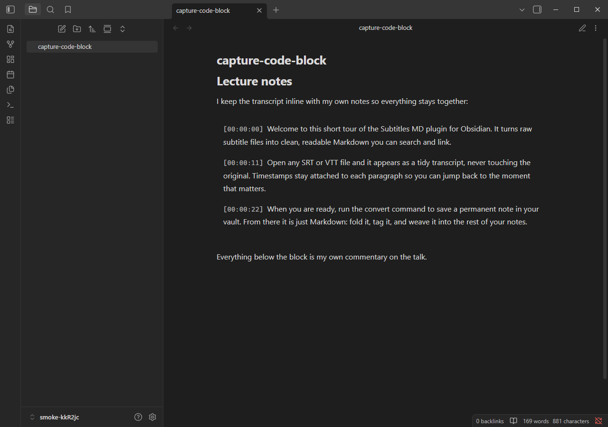
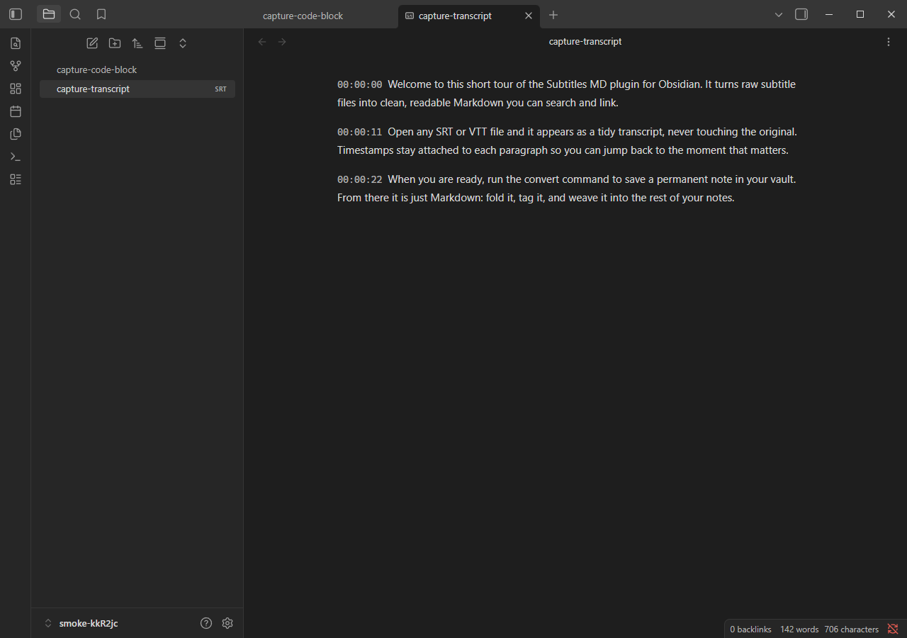
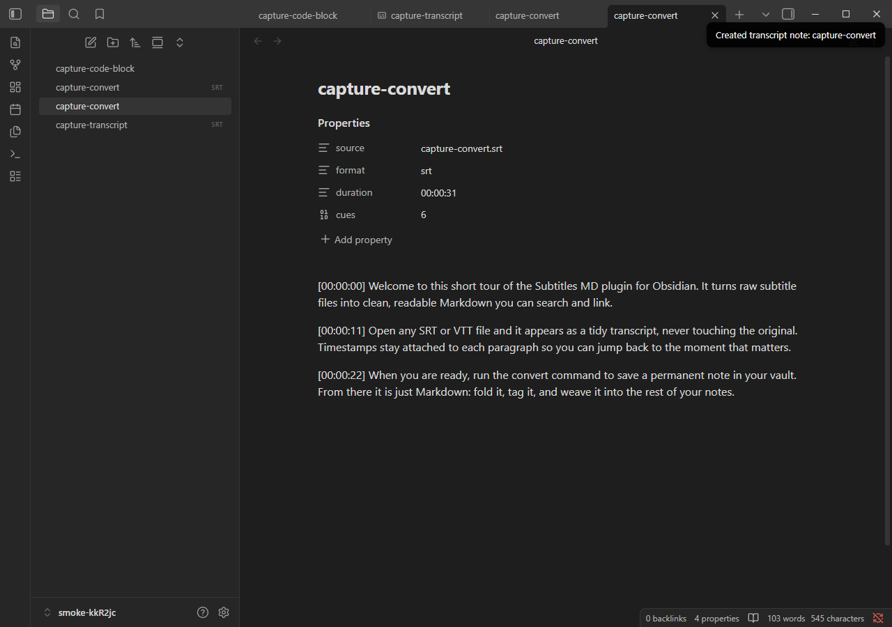
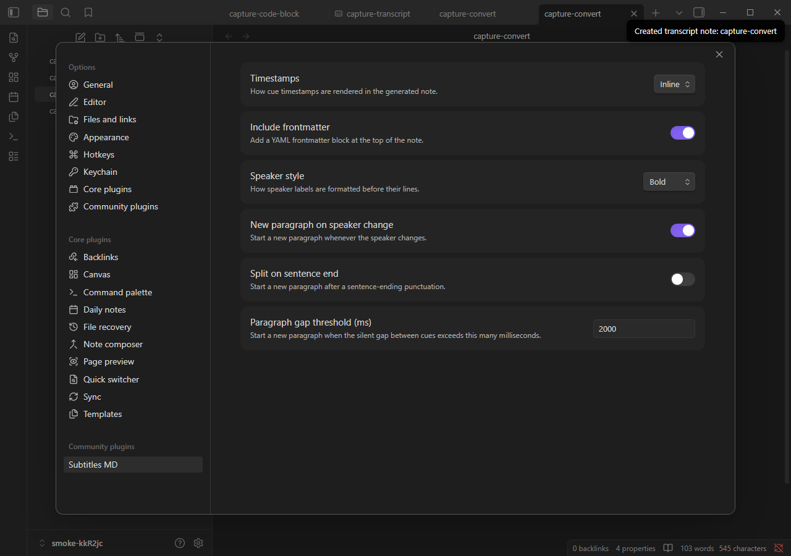

# Subtitles MD

Read `.srt`/`.vtt` subtitle & transcript files as comfortable, searchable Markdown in Obsidian — no media playback required.

## Features

- **Convert subtitle files to notes** — run the "Convert subtitle file to transcript note" command on any `.srt`/`.vtt` file to create a clean, readable Markdown note.
- **Embed transcripts with code blocks** — use ` ```transcript ` blocks to render inline subtitle content or reference a subtitle file with `file: path/to/sub.srt`.
- **Read-only transcript view** — click any `.srt`/`.vtt` file in your vault to open it as a readable transcript without converting it.
- **Configurable reflow & formatting** — control how cues are grouped into paragraphs, how timestamps and speakers are displayed, and whether to include frontmatter metadata — all via Settings.
- **Pure Markdown output** — transcript text becomes first-class vault content: searchable via Obsidian's search, linkable with `[[wikilinks]]`, and ready for annotation.

## Screenshots

### Code Block Rendering



A `transcript` code block renders inline subtitle content as clean, readable paragraphs in reading view.

### Read-Only File View



Click any `.srt` or `.vtt` file in your vault to open it as a readable transcript without converting it.

### Converted Transcript Note



The "Convert subtitle file to transcript note" command creates a Markdown note with frontmatter properties, timestamps, and formatted speakers.

### Settings Tab



Configure reflow behavior, timestamp display, speaker formatting, and frontmatter inclusion in the plugin's Settings tab.

## Why

Most subtitle/transcript plugins generate transcripts from audio (Whisper, YouTube) or sync playback with media. **Subtitles MD** fills a different niche: it makes *existing* `.srt`/`.vtt` files comfortable to read and turns their text into native, searchable Markdown. Perfect for researchers, students, and anyone who needs to read, annotate, and link transcripts without requiring media playback.

## Installation

### Community Plugins (recommended)

**Note:** Pending review. Once approved, search for **Subtitles MD** in Settings → Community plugins → Browse.

### Manual Install

1. Download or build `main.js`, `manifest.json`, and `styles.css`.
2. Place them in `<vault>/.obsidian/plugins/subtitles-md/`.
3. Enable the plugin in Settings → Community plugins.

## Usage

### Convert a subtitle file to a note

1. Open a `.srt` or `.vtt` file in your vault.
2. Open the command palette (Ctrl/Cmd+P) and run **"Convert subtitle file to transcript note"**.
3. A new Markdown note is created in the same folder, containing the transcript as readable paragraphs.

### Embed a transcript code block

Reference a subtitle file in your vault:

````markdown
```transcript
file: Recordings/talk.srt
```
````

Or paste inline subtitle content:

````markdown
```transcript
1
00:00:01,000 --> 00:00:03,500
Welcome to the demo.

2
00:00:04,000 --> 00:00:06,800
This is a sample subtitle block.
```
````

Both render as clean, readable transcripts in reading view.

### Open a subtitle file as a transcript

Click any `.srt` or `.vtt` file in the file explorer. The plugin opens it in a read-only transcript view (no conversion required).

## Settings

| Setting                          | Description                                                         | Default   |
| -------------------------------- | ------------------------------------------------------------------- | --------- |
| **Timestamps**                   | How timestamps are rendered (None / Inline / Aside)                 | Inline    |
| **Include frontmatter**          | Add a YAML frontmatter block with metadata                          | On        |
| **Speaker style**                | Format speaker labels as Bold or Heading                            | Bold      |
| **New paragraph on speaker change** | Start a new paragraph when the speaker changes                   | On        |
| **Split on sentence end**        | Force a paragraph break at sentence boundaries                      | Off       |
| **Paragraph gap threshold (ms)** | Minimum silence duration to start a new paragraph                   | 2000      |

## Supported Formats

- `.srt` (SubRip)
- `.vtt` (WebVTT)

## Development

```bash
pnpm install       # Install dependencies (Node 22+ recommended)
pnpm run build     # Build the plugin
pnpm test          # Run tests
pnpm run lint      # Lint with ESLint
pnpm run typecheck # Type-check with tsc
```

This project follows a **test-driven development** workflow with **Sentinel review** before merging. See [`AGENTS.md`](./AGENTS.md) for details.

### Testing in a Real Vault

The `install:vault` command builds the plugin and installs it into an Obsidian vault. The target vault is resolved in order of precedence:

1. **`--vault <path>`** — command-line argument (supports `--vault path` or `--vault=path`)
2. **`OBSIDIAN_VAULT`** — environment variable
3. **`test-vault/`** — the demo vault committed to this repo

**Quick start with the bundled demo vault:**

```bash
pnpm install:vault
```

Then open `test-vault/` in Obsidian, reload with Ctrl+R, and enable **Subtitles MD** in Settings → Community plugins. Try opening `Recordings/talk.srt` or `Demo.md` in reading view.

**Install to your own vault:**

```bash
pnpm install:vault --vault "C:\path\to\YourVault"
# or
export OBSIDIAN_VAULT="C:\path\to\YourVault"  # Unix/macOS
set OBSIDIAN_VAULT=C:\path\to\YourVault       # Windows cmd
$env:OBSIDIAN_VAULT="C:\path\to\YourVault"    # Windows PowerShell
pnpm install:vault
```

**Live development loop:**

1. Create a symlink from your vault to the repository (one-time setup):
   ```powershell
   # Windows PowerShell
   New-Item -ItemType SymbolicLink -Path "<vault>\.obsidian\plugins\subtitles-md" -Target "<repo>"
   ```
   ```bash
   # Unix/macOS
   ln -s /path/to/repo /path/to/vault/.obsidian/plugins/subtitles-md
   ```

2. Run the dev watcher to rebuild on changes:
   ```bash
   pnpm dev
   ```

3. Reload Obsidian (Ctrl+R) to pick up changes, or install the community **Hot Reload** plugin for automatic reloading.

## Contributing

See [`AGENTS.md`](./AGENTS.md) and [`docs/DEVELOPMENT-WORKFLOW.md`](./docs/DEVELOPMENT-WORKFLOW.md) for workflow, testing, and contribution guidelines.

## License

[MIT](./LICENSE) © 2026 Pedro Fuentes
